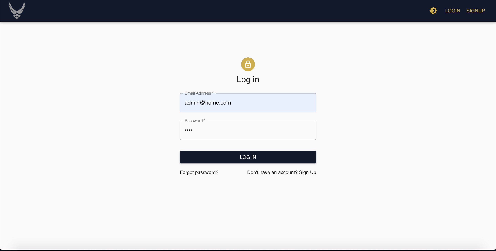

<!-- PROJECT SHIELDS -->
<!--
*** I'm using markdown "reference style" links for readability.
*** Reference links are enclosed in brackets [ ] instead of parentheses ( ).
*** See the bottom of this document for the declaration of the reference variables
*** for contributors-url, forks-url, etc. This is an optional, concise syntax you may use.
*** https://www.markdownguide.org/basic-syntax/#reference-style-links
-->


<!-- PROJECT LOGO -->
<br />
<p align="center">
  <a href="https://github.com/dlam96/cop4934-frontend">
    
  </a>

  <h2 align="center">COP4934 Senior Design II FrontEnd</h2>
  <h6 align="center">Formerly sponsored by US Moody Air Force Base</h6>
  <p align="center">
    A Calendar Scheduler Web Application Built for United State Air Force Flight Scheduling
    <br />
    <br />
    <a href="https://airforceofs.com/">View Demo</a>
    ·
    <a href="https://github.com/dlam96/cop4934-frontend/issues">Report Bug</a>
    ·
    <a href="https://github.com/dlam96/cop4934-frontend/issues">Request Feature</a>
  </p>
</p>


<!-- TABLE OF CONTENTS -->
## Table of Contents

* [About the Project](#about-the-project)
  * [Built With](#built-with)
* [Getting Started](#getting-started)
  * [Installation](#installation)
* [Contributing](#contributing)
* [License](#license)
* [Contact](#contact)
* [Acknowledgements](#acknowledgements)


<!-- ABOUT THE PROJECT -->
## About The Project
<p align="center">
  <a href="https://github.com/dlam96/cop4934-frontend">
    
  </a>
</p>

Moody Air Force Base, located in Lowndes County, Georgia, created this project with the goal of developing an easier, more efficient, and more reliable method for scheduling flights [and viewing flight schedules] at Moody (with a stretch goal of expanding the use of the software to other United States Air Force bases). The current software they use has proven unreliable (often the system is unavailable). They have resorted to entering data, which has been given to schedulers verbally, into static Excel sheets. This method is prone to clerical errors and is extremely time consuming.

Our goal is to provide a software solution that is easy to use and increases productivity; additionally, the software aids in preventing human, clerical errors.

<p align="center">
  <a href="https://github.com/dlam96/Knight-Hacks-2020">
    
  </a>
</p>
<p align="center">
  <a href="https://github.com/dlam96/Knight-Hacks-2020">
    
  </a>
</p>

### Built With
* [ReactJS](https://reactjs.org)
* [React Redux](https://react-redux.js.org/)
* [Material-UI](https://material-ui.com/)

<!-- GETTING STARTED -->
## Getting Started

### Installation

1. Clone the repo
```sh
git clone https://github.com/dlam96/cop4934-frontend
```
2. Install NPM packages
```sh
yarn install
```
3. Start the server
```sh
yarn start
```


<!-- LICENSE -->
## License

Distributed under the MIT License. 


<!-- CONTACT -->
## Contact

[Daniel Lam](https://github.com/dlam96) - FrontEnd Lead - [Linked-in](https://www.linkedin.com/in/dlam96) - dlam96@knights.ucf.edu

[Justin Hawtree](https://github.com/JustinHawtree) - BackEnd Lead - [Linked-in](https://www.linkedin.com/in/justin-hawtree) - JustinHawtree@knights.ucf.edu


<!-- ACKNOWLEDGEMENTS -->
<!-- ## Acknowledgements-->


<!-- MARKDOWN LINKS & IMAGES -->
<!-- https://www.markdownguide.org/basic-syntax/#reference-style-links -->
[product-screenshot]: images/demo1.png
